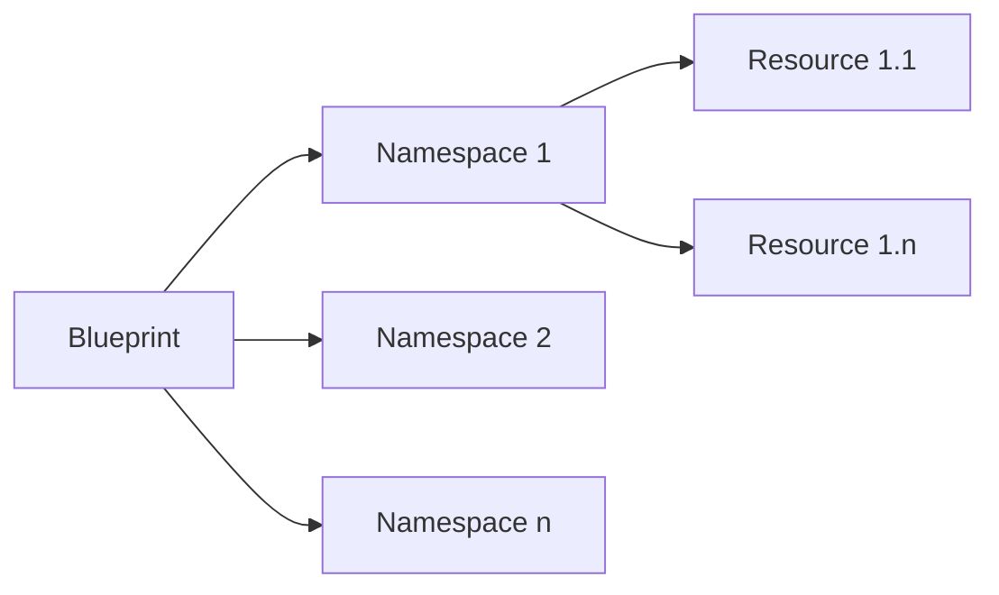

# Python 3 Formation 3


# Introduction au web

L'une des forces de Python c'est qu'il existe des bibliothèques pour à peu près tout , nous avons vu comment interagir avec nos programmes depuis la console, voyons comment interagir depuis de web.

Le plus simple pour créer une application web en Python est d'utiliser des bibliothèques déjà existantes.
Les plus connus sont Django et Flask.
Django : https://www.djangoproject.com/
Flask : http://flask.pocoo.org/

La différence entre Djanog et Flask se situe dans les capacités présentes de base dans les bibliothèques, Django est très complet tandis que Flask fournit le minimum.

Nous allons étudier Flask, l'avantage de Flask est que la courbe de progression est plus douce que celle de Django et qu'il possède une syntaxe très lisible.

Exemple d'une application affichant Hello World à l'adresse http://localhost:5552:
```python
from flask import Flask
app = Flask(__name__)
@app.route("/")
def hello():
    return "Hello World!"

if __name__ == '__main__':  
    import os  
    HOST = os.environ.get('SERVER_HOST', 'localhost')  
    try:  
        PORT = int(os.environ.get('SERVER_PORT', '5552'))  
    except ValueError:  
        PORT = 5552  
  
  app.run(HOST, PORT, debug=True) # On Windows  
  #app.run(HOST, PORT, debug=True, processes=3) # On Linux 
  #app.run('0.0.0.0', 8000, processes=3) # On docker
```
 
# 1- Flask

Flask est une bibliothèque de type micro framework, c'est-à-dire qu'elle contient le strict minimum pour réaliser une application web, si nous souhaitons plus de fonctionnalités, il est possible d'installer des extensions.

Cette approche permet de créer des applications web légères et souples.

## Installation 

Pour installer Flask il suffit d'utiliser `pip`
```
pip install flask
```

## Routes

Flask repose sur la notion de route, à chaque route correspond une fonction.
Pour lier une fonction à une route, il suffit d'utiliser un décorateur `@app.route`

Exemple :
```python
from flask import Flask
app = Flask(__name__)
@app.route("/")
def hello():
    return "Hello World!"
@app.route("/toto")
def toto():
    return "toto"
```

`@app.route` 
permet de définir le comportement de l'application quand la route est appelée depuis le web.
Il est possible de créer des routes avec des paramètres à l'aide `<`, `>` et en ajoutant le paramètre dans la fonction

```python
@app.route('/books/<book_id>')  
def book(book_id):  
    return "Book #" + str(book_id)
```

Ici nous avons défini un paramètre `book_id`.
Par défaut les paramètres sont des strings.
Il est possible de spécifier le type de paramètre attendu, exemple un int

```python
@app.route('/books/<int:book_id>')  
def book(book_id):  
    return "Book #" + str(book_id)
```

## Structure de code

La structure de code d'une application est relativement libre du moment que l'on respecte les règles d'import de Python, cependant une bonne structure apporte plus de lisibilité et permet une meilleure évolution de l'application.

Voici une bonne structure pour commencer :
```
app
  __init__.py
  routes.py
runserver.py
```

Le dossier app contient l'ensemble de notre application, il est composé de 2 fichiers :
- `__init__.py` contient notre application
- `routes.py` contient les fonctions correspondants aux routes


Fichier `app/__init__.py`

```python
from flask import Flask  
  
app = Flask(__name__)  
  
from . import routes
```

fichier `app/routes.py`
```python
from app import app  
  
  
@app.route('/')  
def index():  
    return "Hello World!"
```

Le fichier `runserver.py` permets de lancer notre serveur de développement :

```python
from app import app  
  
  
if __name__ == '__main__':  
    import os  
    HOST = os.environ.get('SERVER_HOST', 'localhost')  
    try:  
        PORT = int(os.environ.get('SERVER_PORT', '5552'))  
    except ValueError:  
        PORT = 5552  
  
  app.run(HOST, PORT, debug=True) # On Windows  
  #app.run(HOST, PORT, debug=True, processes=3) # On Linux 
  #app.run('0.0.0.0', 8000, processes=3) # On docker
```

En  lançant le fichier `runserver.py` nous pouvons accéder à notre service à l'adresse `http://localhost:5552` 

# 2 - Templating

Flask possède un puissant moteur de template nommé Jinja2, celui-ci nous permet de générer des pages HTML paramétrables.

Créons un dossier `templates` dans le dossier `app`, Flask ira directement chercher les templates dans ce dossier.

Prenons une page simple page HTML affichant un message:

Fichier `app/templates/hello.html`
```html
<!doctype html>
<html lang="fr">
  <head>
    <title>Title</title>
  </head>
  <body>
    <h1>Hello {{ name }}</h1>
  </body>
</html>
``` 

Nous indiquons que nous attendons un paramètre `name` à l'aide des doubles moustaches `{{`...`}}`

Nous allons ensuite générer la page web à l'aide de la méthode `render_template`

```python
from flask import render_template  
from app import app  
  
  
@app.route('/hello')  
def index():  
    return render_template('hello.html', name='Toto') # On fournit le paramètre name
```

## Découpage des fichiers

Le moteur de template Jinja2 nous permet de découper notre page en plusieurs fichiers et d'étendre des pages HTML.

Cela nous permet par exemple d'éviter de recopier le corps de la page à chaque nouvelle page HTML créée.

Pour réaliser cela, créons un fichier `base.html` qui contiendra un élément `content` destiné à afficher le reste de notre page web.

Pour définir un bloc la syntaxe est ``.

Fichier `app/templates/base.html`
```html
<!doctype html>
<html lang="fr">
  <head>
    <title>{{ title }}</title>
  </head>
  <body>
    
  </body>
</html>
```

Créons maintenant un fichier `home.html` qui contiendra la page d’accueil.

Pour cela nous allons redéfinir le bloc `content` de la page `base.html`
Pour étendre une page, la syntaxe est ``.

Fichier `app/templates/home.html`
```html


    <h1>Home page</h1>

```

Appelons maintenant notre page dans le fichier `routes.py`

```python
from flask import render_template  
from app import app  
  
  
@app.route('/home')  
def home():  
    return render_template(  
        'home.html',  
        title='Home'
  )
```

## Paramètres

Nous avons vu comment passer des types de variables simples à une page HTML, mais il est  possible des passer n'importe quel type de variable en paramètres.

Exemple pour un objet et un dictionnaire dans un fichier `users.html` :

Fichier `app/templates/users.html`
```html


<div>
    <div>
        <h2>{{ user1['name'] }}</h2>
    </div>
    <br>
    <div>
        <h2>{{ user2.name }}</h2>
    </div>
</div>

```

Fichier `app/routes.py`
```python
from flask import render_template
from app import app

class User:
    def __init__(self, name):
        self.name = name

@app.route('/')
def index():
    return render_template(
        'users.html',
        title='Users',
        user1={'name': 'Will'},
        user2=User('Dustin')
    )
```

## Boucles 

Le moteur Jinja2 nous permet de réaliser des boucles sur des objets itérables tels que les listes.

La syntaxe pour réaliser une boucle est : ` .... `, le code HTML contenu à l'intérieur du bloc sera répété autant de fois qu'il y a d'élément dans la variable.

Reprenons notre exemple `users.html` et insérons une boucle pour afficher une liste d'utilisateurs : 

Fichier `app/templates/users.html`
```html


<div>
    
    <div>
        <h2>{{ user.name }}</h2>
    </div>
    
    <br>
    
</div>

```

Modifions notre fichier `routes.py` afin de fournir une liste d'utilisateur :

```python
@app.route('/')
def index():
    return render_template(
        'users.html',
        title='Users',
        users=[User('Will'), User('Dustin'),
               User('Mike'), User('Hooper'),
               User('Whopper')
               ]
    )
```

## Conditions

Il est aussi possible de réaliser des conditions dans nos pages HTML à l'aide de la syntaxe :

```html




```

Reprenons notre fichier `users.html` et ajoutons une erreur si le paramètre `users` n'est pas fourni :

Fichier `app/templates/users.html`
```html


<div>
    
        
        <div>
            <h2>{{ user.name }}</h2>
        </div>
    
        <br>
        
    
    
        <p>Alert ! Users is None</p>
    
    
</div>

```

Essayez de ne plus fournis le paramètre `users` dans le fichier `routes.py`, la page web affichera une alerte `Alert ! Users is None`.

Les conditions nous permettent par exemple d'afficher des éléments uniquement si l'utilisateur est connecté.

## Fichiers statiques
En général qui dit application web dit feuille de style et scripts, par défaut Flask va chercher les fichiers statiques dans le dossier `static` de votre application, en interne Flask possède une fonction pour gérer les fichiers statiques.

Créons un dossier `static` dans le dossier `app` et ajoutons un fichier `default.css`

Fichier `app/static/default.css`
```css
h1 {
    color: green;
}
```

Modifions maintenant notre fichier `base.html` pour inclure cette nouvelle feuille de style.

Pour avoir l'URL de notre fichier, nous allons utiliser `url_for` qui permet d'avoir la route d'une fonction, ici nous souhaitons accéder à la fonction de gestion des fichiers statiques.

Profitons-en pour créer un bloc `style` qui contient nos feuilles de style, de cette manière nous pourrons étendre le bloc dans des pages enfantes en utilisant `{{ super() }}`.

Fichier `app/templates/base.html`
```html
<!doctype html>
<html lang="fr">
<head>
    <title>{{ title }}</title>
    
    <link rel="stylesheet" type="text/css" href="{{ url_for('static', filename='default.css') }}">
    
</head>
<body>
    
</body>
</html>
```

Nous pouvons même créer un système de thème à l'aide des conditions, créons un fichier `blue.css` et `red.css`

Fichier `app/static/blue.css`
```css
h1 {
    color: blue;
}
```

Fichier `app/static/red.css`
```css
h1 {
    color: red;
}
```

Modifions de nouveau notre fichier `base.html`

Fichier `app/templates/base.html`
```html
<!doctype html>
<html lang="fr">
<head>
    <title>{{ title }}</title>
    
    
        <link rel="stylesheet" type="text/css" href="{{ url_for('static', filename='blue.css') }}">
    
        <link rel="stylesheet" type="text/css" href="{{ url_for('static', filename='red.css') }}">
    
        <link rel="stylesheet" type="text/css" href="{{ url_for('static', filename='default.css') }}">
    
    
</head>
<body>
    
</body>
</html>
```

Nous pouvons désormais fournir un paramètre thème dans notre fichier `routes.py`

```python
@app.route('/home')
def home():
    return render_template(
        'home.html',
        title='Home',
        theme='red'
    )
```

# 3 - Configuration 

Chaque application Flask possède une configuration qu'il est possible de lire ou de modifier, certainnes fonctions ou extensions nécessites d'ajouter une valeur à la configuration.

## Usage
Pour modifier la configuration de notre application, il faut modifier le dictionnaire `config` de notre objet `app`

Fichier `app/__init__.py`
```python
from flask import Flask  
  
app = Flask(__name__)
app.config['MY_KEY'] = 'ma_valeur' 
  
from . import routes
```

# 4 - Messages flash

Les messages flash sont un moyen de stocker des messages qui seront accessibles une seule fois, ils sont pratiques, car ils peuvent être utilisés d'une page à l'autre.

L'utilisation des messages flash nécessite que la valeur `SECRET_KEY` soit définie dans notre application

Fichier `app/__init__.py`
```python
from flask import Flask  
  
app = Flask(__name__)
app.config['SECRET_KEY'] = 'my_secret_key'
  
from . import routes
```

Pour ajouter un message flash, il suffit d'utiliser la fonction `flash` qui prend en paramètre le message à stocker.

Nous pouvons ensuite récupérer les messages flash à l'aide de la fonction `get_flashed_messages()`

Exemple :
```python
from flask import render_template, flash, redirect
...

@app.route('/')
def index():
    flash('Redirection depuis index')
    return redirect('/home')

@app.route('/home')
def home():
    return render_template('home.html', title='Home')
```

Fichier `app/templates/home.html`
```html


<div>
    
      
        <ul style="color: red;">
        
          <li>{{ message }}</li>
        
        </ul>
      
    
</div>

```

Le mot clé `with` permet de créer un bloc et de limiter la portée des variables, ainsi `messages` et uniquement disponible dans le bloc ``

# 5 - Formulaires

Pour gérer les formulaires de manière simple, nous allons ajouter l'extension `flask-wtf`.

Cette extension nous permet de traiter les formulaires sous forme d'objet et d'ajouter des règles de validation de données pour les champs du formulaire.

## Installation :

```
pip install flask-wtf
```

Pour fonctionner, `flask-wtf` nécessite que la valeur `SECRET_KEY` soit définie dans notre application

## Usage

`flask-wtf` nous permet de considérer les formulaires comme des objets, pour cela il suffit d'étendre l'objet `FlaskForm` présent dans `flask-wtf`.

Chaque attribut de l'objet représente un champ du formulaire, et chaque attribut possède un type de champ.

Le choix des champs est important, car `flask-wtf` va générer le code HTML du champ.

Nous pouvons définir des règles de validation des champs, il suffit de spécifier le paramètre `validators` qui attend un tableau de règles de validation, ici `DataRequired`

Créons un fichier `forms.py` qui contient un formulaire d'authentification.
Le formulaire contient :
- Un champ texte obligatoire pour le nom d'utilisateur
- Un champ obligatoire pour le mot de passe
- Un bouton permettant de valider le formulaire

Fichier `app/forms.py`
```python
from flask_wtf import FlaskForm
from wtforms import StringField, PasswordField, SubmitField
from wtforms.validators import DataRequired

class LoginForm(FlaskForm):
    username = StringField('Nom d\'utilisateur', validators=[DataRequired()])
    password = PasswordField('Mot de passe', validators=[DataRequired()])
    submit = SubmitField('Connexion')
```

Créons une page `login.html` qui hérite de la page `base.html` et qui contient notre page d'authentification.

Cette page prend en paramètre un formulaire à afficher.

Fichier `app/templates/login.html`
```html


    <h1>Authentification</h1>
    <form action="" method="post">
        {{ form.hidden_tag() }}
        <div>
            {{ form.username.label }}<br>
            {{ form.username(size=8) }}
        </div>
        <br>
        <div>
            {{ form.password.label }}<br>
            {{ form.password(size=8) }}
        </div>
        <br>
        <div>
            {{ form.submit() }}
        </div>
    </form>

```

Appelons maintenant notre fichier `login.html` dans le fichier `routes.py`

```python
from .forms import LoginForm
...

@app.route('/login')
def login():
    form = LoginForm()
    return render_template(
        'login.html',
        title='Authentification',
        form=form
    )
```

Si nous lançons notre service, nous avons bien notre page d'authentification accessible via la route `/login`.

## Récupérer les valeurs d'un formulaire

La récupération de valeurs d'un formulaire est une tache très simple à l'aide de `flask-wtf`, il suffit d'utiliser la méthode `validate_on_submit()` de l'objet formulaire.

Si le formulaire contient des règles de validation et que celles-ci ne sont pas satisfaites, `flask-wtf` ne considérera pas le formulaire comme valide.

Pour récupérer les valeurs d'un formulaire, il faut ajouter la méthode POST à notre route.

Le décorateur `@app.route` peux définir une route (unique exemple vue jusque ici) mais aussi les méthodes HTTP que nous acceptons de traiter ou non, par défaut une route accepte uniquement la méthode HTTP `GET`

Pour accepter plus de méthodes, il faut ajouter `methods=[]` au décorateur.

Si le formulaire est valide, nous redirigeons l'utilisateur sur la page d’accueil de notre service, sinon nous affichons de nouveau le formulaire.

```python
@app.route('/login', methods=['GET', 'POST'])
def login():
    form = LoginForm()
    if form.validate_on_submit():
        print('{0} : {1}'.format(form.username.data, form.password.data)) # Affichage pour debug
        return redirect('/')
    return render_template('login.html', title='Sign In', form=form)
```

A l'aide de `DataRequired` nous sommes sûrs de récupérer un nom d'utilisateur et un mot de passe, charge à nous de vérifier si l'utilisateur existe.

# 6 - ORM

Les ORM sont des bibliothèques de mapping objet-relationnel qui nous permettent de "stocker" des objets Python dans nos bases de données.

En respectant une syntaxe propre à chaque ORM, nous n’avons plus besoin d'écrire du langage de base de données pour accéder à nos données.

## SQLAlchemy

SQLAlchemy est la bibliothèque ORM de référence en Python pour interagir avec une base SQL, elle gère toutes les bases de données de type SQL (ou presque toutes)

La version Flask de la bibliothèque s'appelle `flask-sqlalchemy`

## Installation

```
pip install flask-slqalchemy
```

`flask-sqlalchemy` nécessite 2 configurations supplémentaires :
- `SQLALCHEMY_DATABASE_URI` qui est l'URI de la base de données
- `SQLALCHEMY_TRACK_MODIFICATIONS` qui permet de rendre `flask-sqlalchemy` moins verbeux et plus rapide

Exemple pour une base de données SQLite `app.db` contenue dans notre dossier `app`

Fichier `app/__init__.py`
```python
import os
from flask import Flask
basedir = os.path.abspath(os.path.dirname(__file__))
db_uri = 'sqlite:///' + os.path.join(basedir, 'app.db')
app = Flask(__name__)
app.config['SECRET_KEY'] = 'my_secret_key'
app.config['SQLALCHEMY_DATABASE_URI'] = db_uri
app.config['SQLALCHEMY_TRACK_MODIFICATIONS'] = False

from . import routes
```

Il faut ensuite créer un objet `SQLAlchemy` qui prend en paramètre notre application Flask

Fichier `app/__init__.py`
```python
import os
from flask import Flask
from flask_sqlalchemy import SQLAlchemy

basedir = os.path.abspath(os.path.dirname(__file__))
db_uri = 'sqlite:///' + os.path.join(basedir, 'app.db')
app = Flask(__name__)
app.config['SECRET_KEY'] = 'my_secret_key'
app.config['SQLALCHEMY_DATABASE_URI'] = db_uri
app.config['SQLALCHEMY_TRACK_MODIFICATIONS'] = False
db = SQLAlchemy(app)

from . import routes
```

## Déclaration

`flask-sqlalchemy` nous permet de "stocker" nos objets en base de données, pour cela il suffit d'étendre la classe `Model` présent dans `SQLAlchemy`.

Chaque objet représente une table de la base et chaque attribut représente une colonne.

Chaque colonne contient un type de données défini, il est possible d'ajouter des contrôles tels que `primary_key`, `nullable`, `index`, `unique`, `default`, etc ...

Créons un fichier `models.py` qui contient un objet représentant un utilisateur du système.

Fichier `app/models.py`
```python
from app import db

class User(db.Model):
    """
    Représente un utilisateur
    """
    id = db.Column(db.Integer, primary_key=True)
    username = db.Column(db.String(64), index=True, unique=True)
    password_hash = db.Column(db.String(128))
```

Pour créer notre base à partir de notre code, il existe plusieurs solutions telles que `flask-migrate` qui génère des scripts de migration à partir de nos objets, ici nous allons utiliser une méthode plus simple et laisser `SQLAlchemy` créer notre base.

Pour cela il faut importer l'ensemble des objets du modèle et utiliser la méthode `create_all`

Ficier `app/__init__.py`
```python
...
db = SQLAlchemy(app)  
  
from . import routes  
  
from .models import User  
  
db.create_all()
```

Ainsi notre base de données sera créée au démarrage de l'application si elle n'existe pas.

L'inconvénient de cette méthode est que si un objet de l'ORM est modifié, il faut supprimer la base de données.

## Nom de table

SQLAlchemy utilise le nom de notre objet pour créer un nom de table, ainsi la classe `User` donne le nom de table `user`.

Cela est très pratique la plupart du temps, mais peut poser certains problèmes dans le cas de nom d'objet contenant plusieurs majuscules, par exemple `MasterChiefWeapon` donne le nom de table `master_chief_weapon`.

En soi, ce n'est pas un problème de mettre un underscore à chaque majuscule, mais il faut s'en souvenir lors d'ajout de clés étrangères.

Il est possible de définir nous-mêmes le nom de la table dans laquelle seront stockés nos objets à l'aide de l'attribut `__tablename__`

```python
class User(db.Model):
    __tablename__ = 'users'
    id = db.Column(db.Integer, primary_key=True)
    username = db.Column(db.String(64), index=True, unique=True)
    password_hash = db.Column(db.String(128), nullable=False)
```

## Usage

Testons notre classe `User`, pour cela plaçons notre terminal dans le dossier de notre application et lançon Python 3

De la importons notre classe `User` et l'objet `db` depuis le module `models` (voir la formation 1 pour la notion de module / package).

```python
(venv) >python
Python 3.5.4 (v3.5.4:3f56838, Aug  8 2017, 02:17:05) [MSC v.1900 64 bit (AMD64)] on win32
Type "help", "copyright", "credits" or "license" for more information.
>>> from app.models import User, db
>>>
```

### Insertion
Pour insérer un utilisateur, il suffit de créer un nouvel objet et de le fournir à l'objet `db`.

L'objet `db` contient un objet `session`, comme en SQL, nos modifications sont enregistrées en base seulement si nous réalisons un `commit`.

```python
>>> from app.models import User, db
>>> u = User(username='Will', password_hash='secret')
>>> # Ajout en base
>>> db.session.add(u) # Ajout dans la session
>>> db.session.commit() # Enregistrement de l'ajout
>>> u.id
1
```

SQLAlchemy à enregistrer notre utilisateur et à modifier l'objet qui possède maintenant un identifiant unique.

Si nous essayons de nouveau d'ajouter un utilisateur nommé `Will` SQLAlchemy lèvera une exception, car l'attribut `username` est défini comme unique.

```python
>>> u2 = User(username='Will', password_hash='super secret')
>>> db.session.add(u2)
>>> db.session.commit()
Traceback (most recent call last):
  File "C:\Users\averd\PycharmProjects\py_micro_front\venv\lib\site-packages\sqlalchemy\engine\base.py", line 1193, in _execute_context
    context)
  File "C:\Users\averd\PycharmProjects\py_micro_front\venv\lib\site-packages\sqlalchemy\engine\default.py", line 507, in do_execute
    cursor.execute(statement, parameters)
sqlite3.IntegrityError: UNIQUE constraint failed: user.username
>>>
>>> db.session.rollback()
```

### Récupérer un objet à partir de son identifiant
Pour récupérer un objet à partir de son identifiant on utilise l'attribut `query` de l'objet `Model` (la classe mère de nos objets).

Cet attribut possède une méthode `get` qui attend la valeur de la clé primaire permettant d'identifier l'objet, en retour elle retourne l'objet si il existe, sinon `None`

```python
>>> u = User.query.get(1)
>>> u
<User 1>
>>> u.username
'Will'
>>> u = User.query.get(100)
>>> u is None
True
```

### Récupérer des objets  

La recherche d'un objet utilise aussi l'attribut `query`.

Nous pouvons récupérer l'ensemble des objets à l'aide de `all` et le premier objet à l'aide de `first`

```python
>>> l_u = User.query.all()
>>> l_u
[<User 1>, <User 2>]
>>> u = User.query.first()
>>> u
<User 1>
>>>
```

### Recherche d'un objet
La recherche d'un objet utilise aussi l'attribut `query`, cette fois nous utilisons la méthode `filter_by` qui attend le nom de l'attribut et la valeur recherchée.

Cette méthode retourne un objet de type `query`, nous pouvons donc récupérer l'ensemble des éléments avec `all` et le premier avec `first`.

```python
>>> l_u = User.query.filter_by(username='Will').all()
>>> l_u
[<User 1>]
>>> l_u = User.query.filter_by(username='Dustion').all()
>>> l_u
[]
>>> u = User.query.filter_by(username='Will').first()
>>> u
<User 1>
>>> u = User.query.filter_by(username='Dustin').first()
>>> u is None
True
```

### Modification d'un objet
Pour modifier un objet, il suffit de modifier ses attributs et de l'ajouter de nouveau à notre base de données, SQLAlchemy fait la mise à jour de manière transparente.

Il ne faut pas oublier d'utiliser la méthode `commit` pour enregistrer les modifications dans la base de données.

```python
>>> u = User.query.get(1)
>>> u.password_hash
'secret'
>>> u.password_hash = 'super secret'
>>> db.session.add(u)
>>> db.session.commit()
>>> u_t = User.query.get(1)
>>> u_t.password_hash
'super secret'
>>>
```

### Supprimer un objet
Pour supprimer un objet, il suffit de le fournir à notre objet `db` à l'aide de la méthode `delete`.

Il ne faut pas oublier d'utiliser la méthode `commit` pour enregistrer les modifications dans la base de données.

```python
>>> l_u = User.query.all()
>>> l_u
[<User 1>, <User 2>]
>>> u = User.query.first()
>>> u
<User 1>
>>>
>>> db.session.delete(u)
>>> db.session.commit()
>>> l_u = User.query.all()
>>> l_u
[<User 2>]
>>>
```

## Relations

Qui dit base de données relationnelle dit relation, SQLAlchemy nous permet de les définir très facilement. voyons la plus courante, one to many 

### One to many

Prenons l'exemple d'un forum, ce forum est composé de topics et chaque topic contient des messages d'utilisateurs.

Concentrons-nous sur la relation topic to messages.

```python
from datetime import datetime
from app import db

class Topic(db.Model):
    id = db.Column(db.Integer, primary_key=True)
    name = db.Column(db.String(32), index=True, unique=True)

class Message(db.Model):
    id = db.Column(db.Integer, primary_key=True)
    ts = db.Column(db.DateTime, index=True, default=datetime.utcnow)
    content = db.Column(db.String(128), nullable=False)
``` 

Pour ajouter la relation, il faut à la fois modifier la classe `Topic` et la classe `Message`.

Dans la classe `Message` il faut déclarer une clé étrangère à l'aide de `ForeignKey`, on fournit la table et la colonne.

```python
class Message(db.Model):  
    id = db.Column(db.Integer, primary_key=True)  
    ts = db.Column(db.DateTime, index=True, default=datetime.utcnow)  
    content = db.Column(db.String(128), nullable=False)  
  
    topic_id = db.Column(db.Integer, db.ForeignKey('topic.id'), nullable=False)
```

Dans la classe `Topic` nous définissons la relation à proprement parler.
Une relation attend au moins 3 paramètres :
- La classe de l'objet concerné par la relation
- Le `backref`, ce paramètre modifie l'objet concerné par la relation en ajoutant un attribut permettant de remonter la relation
- Le `lazy` qui permet de définir la méthode de chargement des objets de la relation

```python
class Topic(db.Model):  
    id = db.Column(db.Integer, primary_key=True)  
    name = db.Column(db.String(32), index=True, unique=True)
    
    messages = db.relationship('Message', backref='topic', lazy='dynamic')
``` 

Nous pouvons maintenant accède à l'ensemble des messages d'un topic à l'aide de l'attribut `messages` et nous pouvons connaitre le topic d'un message à l'aide de l'attribut `topic`.

De plus, au lieu de fournir le paramètre `topic_id` lors de la création d'un `Message`, nous pouvons simplement passer un objet `Topic`
Exemple :
```python
>>> from app.models import Topic, Message, db
>>> t = Topic(name='Test')
>>> db.session.add(t)
>>> db.session.commit()
>>> m1 = Message(content='Message 1', topic=t)
>>> db.session.add(m1)
>>> m2 = Message(content='Message 2', topic=t)
>>> db.session.add(m2)
>>> db.session.commit()
>>> t.messages
<sqlalchemy.orm.dynamic.AppenderBaseQuery object at 0x000001CEC597BA20>
>>> t.messages.all()
[<Message 1>, <Message 2>]
>>> m = Message.query.get(1)
>>> m.topic
<Topic 1>
>>> m.topic.name
'Test'
``` 

# 7 - Authentification

L'extension `flask-login` nous permet de mettre en place très simplement un système d'authentification utilisateur.

## Installation 

```
pip install flask-login
```

Il faut ensuite créer un objet `LoginManager` et lui fournir notre application

Fcihier `app/__init__.py`
```python
import os
from flask import Flask
from flask_sqlalchemy import SQLAlchemy
from flask_login import LoginManager
...
db = SQLAlchemy(app)
login = LoginManager(app)
```

## Modèle 

`flask-login` attend un modèle d'utilisateur pour la gestion de l'authentification, pour nous faciliter la vie il nous fournit aussi une classe à étendre pour répondre a ses besoins, la classe `UserMixin`.

Modifions notre classe utilisateur en héritant de la classe `UserMixin` et en rendant notre mot de passe sécurisé.

Pour la sécurisation du mot de passe, nous allons utiliser la fonction `generate_password_hash` présente dans `werkzeug.security`.
`werkzeug` est un package installé en même temps que Flask.

Fichier `app/models.py`
```python
from werkzeug.security import generate_password_hash, check_password_hash
from flask_login import UserMixin
from app import db

class User(UserMixin, db.Model):
    id = db.Column(db.Integer, primary_key=True)
    username = db.Column(db.String(64), index=True, unique=True)
    password_hash = db.Column(db.String(128), nullable=False)
    @property
    def password(self):
        return self.password_hash
    @password.setter
    def password(self, pwd):
        self.password_hash = generate_password_hash(pwd)
    def verify_password(self, pwd):
        return check_password_hash(self.password_hash, pwd)
```

Usage :
```python
>>> from app.models import User, db
>>> u = User(username='will', password='secret')
>>> u.password
'pbkdf2:sha256:50000$O57zfyTK$2e33221fdb921b865256bfde08d8d85e3ecdc3f1e489e54596a65806ef8b15f6'
>>> u.password_hash
'pbkdf2:sha256:50000$O57zfyTK$2e33221fdb921b865256bfde08d8d85e3ecdc3f1e489e54596a65806ef8b15f6'
>>> u.verify_password('secret')
True
>>> db.session.add(u)
>>> db.session.commit()
```

## Loader

Il faut ensuite indiquer à `flask-login` comment charger notre utilisateur, en effet selon la technologie de base de données utilisée (SQL ou NOSQL), la récupération d'un utilisateur diffère.


Pour cela on utilise le décorateur `@login.user_loader` et on fournit une fonction chargée de récupérer un utilisateur à partir de son identifiant.

Fichier `app/models.py`
```python
from werkzeug.security import generate_password_hash, check_password_hash
from flask_login import UserMixin
from app import db, login

@login.user_loader
def load_user(user_id):
    return User.query.get(int(user_id))

class User(UserMixin, db.Model):
    id = db.Column(db.Integer, primary_key=True)
    username = db.Column(db.String(64), index=True, unique=True)
    password_hash = db.Column(db.String(128), nullable=False)
    @property
    def password(self):
        return self.password_hash
    @password.setter
    def password(self, pwd):
        self.password_hash = generate_password_hash(pwd)
    def verify_password(self, pwd):
        return check_password_hash(self.password_hash, pwd)
```

## Authentification

Nous pouvons maintenant authentifier nos utilisateurs, reprenons notre fichier `routes.py` et complétons notre route de login.

Nous pouvons connaitre l'utilisateur courant à l'aide de `current_user` et nous pouvons authentifier un utilisateur à l'aide de `login_user` tous deux présent dans le package `flask_login`

```python
from flask_login import current_user, login_user
from flask import render_template, redirect, flash
from app import app
from app.forms import LoginForm
from app.models import User

@app.route('/')
def index():
    if current_user.is_anonymous:
        return "Hello, login please"
    
    return "Hello " + current_user.username + " !"

@app.route('/login', methods=['GET', 'POST'])
def login():
    # Si déja connecté, redirection vers l'acceuil
    if current_user.is_authenticated:
        return redirect('/')
    # Sinon on creer le formulaire
    form = LoginForm()
    
    # Si l'utilisateur POST le formulaire
    if form.validate_on_submit():
        # On vérifie si l'utilisateur existe
        user = User.query.filter_by(username=form.username.data).first()
        
        # Si le mot de passe n'est pas valide, redirection vers login
        if user is None or not user.verify_password(form.password.data):
            flash('Nom d\'utilisateur ou mot de passe incorrect.')
            return redirect('/login')
        
        # Sinon on authentifie l'utilisateur
        login_user(user)
        redirect('/')
        
    # Sinon on affiche le formulaire
    return render_template('login.html', title='Authentification', form=form)
``` 

## Déconnexion
Pour déconnecter un utilisateur, il faut utiliser la fonction `logout_user` présente dans le package `flask_login`

```python
from flask_login import current_user, login_user, logout_user
from flask import render_template, redirect, flash
from app import app
from app.forms import LoginForm
from app.models import User
...
@app.route('/logout')
def logout():
    logout_user()
    return redirect('/')
```

## Protection des routes

Si on souhaite que certaines routes soient uniquement accessibles aux utilisateurs connectés, il est possible de les protéger à l'aide du décorateur `@login_required`.

Pour cela il faut légèrement modifier notre route `/login` afin que l'utilisateur soit redirigé après le processus de connexion.
Actuellement l'utilisateur est redirigé vers l'index après une connexion.

```python
from flask_login import current_user, login_user, logout_user  
from flask import render_template, redirect, flash, request, url_for  
from werkzeug.urls import url_parse  
from app import app  
from app.forms import LoginForm  
from app.models import User

@app.route('/login', methods=['GET', 'POST'])
def login():
    # Si déja connecté, redirection vers l'acceuil
    if current_user.is_authenticated:
        return redirect('/')
    # Sinon on créer le formulaire
    form = LoginForm()
    # Si l'utilisateur POST le formulaire
    if form.validate_on_submit():
        # On vérifie si l'utilisateur existe
        user = User.query.filter_by(username=form.username.data).first()
        # Si le mot de passe n'est pas valide, redirection vers login
        if user is None or not user.verify_password(form.password.data):
            flash('Nom d\'utilisateur ou mot de passe incorrect.')
            return redirect('/login')
        # Sinon on authentifie l'utilisateur
        login_user(user)
        # Redirection si l'utilisateur souhaitait accéder à une route protégée
        next_page = request.args.get('next')
        if not next_page or url_parse(next_page).netloc != '':
            next_page = '/'
        return redirect(next_page)
    # Sinon on affiche le formulaire
    return render_template('login.html', title='Authentification', form=form)
```

Il faut ensuite indiquer à `flask-login` la route à utiliser pour effectuer un processus de connexion, pour cela on fournit le nom de la **fonction** qui correspond à la route.

Ici notre fonction s'appelle `login`

Fichier `app/__init__.py`
```python
import os  
from flask import Flask  
from flask_sqlalchemy import SQLAlchemy  
from flask_login import LoginManager  
...
  
db = SQLAlchemy(app)  
login = LoginManager(app)  
login.login_view = 'login'
```

Nous pouvons maintenant utiliser notre décorateur `@login_required`

```python
from flask_login import current_user, login_user, logout_user, login_required
from flask import render_template, redirect, flash, request
from werkzeug.urls import url_parse
from app import app
from app.forms import LoginForm
from app.models import User

@app.route('/')
def index():
    if current_user.is_anonymous:
        return "Hello, login please"
    return "Hello " + current_user.username + " !"

@app.route('/me')
@login_required
def me():
    return current_user.username

@app.route('/login', methods=['GET', 'POST'])
def login():
    if current_user.is_authenticated:
        return redirect('/')
    form = LoginForm()
    if form.validate_on_submit():
        user = User.query.filter_by(username=form.username.data).first()
        if user is None or not user.verify_password(form.password.data):
            flash('Nom d\'utilisateur ou mot de passe incorrect.')
            return redirect('/login')
        login_user(user)
        next_page = request.args.get('next')
        if not next_page or url_parse(next_page).netloc != '':
            next_page = '/'
        return redirect(next_page)
    return render_template('login.html', title='Authentification', form=form)

@app.route('/logout')
def logout():
    logout_user()
    return redirect('/')
```

# 8 - BootStrap
BootStrap est parfait quand il s'agit des créer des applications web un peu jolies en un minimum de temps.

Comme nous l'avons vu, `flask-wtf` produit lui-même le code HTML des champs de nos formulaires, ce qui peut poser problème avec des frameworks web type BootStrap qui possèdent leurs propres structures de code.

Face à ça 2 solutions :
- Créer les composants pour Jinja 2 à l'aide des macros (non abordé dans les formations)
- Utiliser une bibliothèque le faisant déjà pour nous.

Nous allons voir la seconde approche qui permet de rapidement prototyper des applications.

Nous allons utiliser `flask-bootstrap` qui contient la version 3 de BootStrap

## Installation

```
pip install flask-bootstrap
```

Il faut ensuite créer un objet `Bootstrap` et lui fournir notre application

```python
import os  
from flask import Flask  
from flask_sqlalchemy import SQLAlchemy  
from flask_login import LoginManager  
from flask_bootstrap import Bootstrap  
...
db = SQLAlchemy(app)  
login = LoginManager(app)  
Bootstrap(app)
```

## Usage
L'utilisation du plugin repose sur le moteur Jinja 2, désormais nos pages HTML doivent hérité de `bootstrap/base.html` à l'aide de ``.

Nous avons ensuite à insérer notre code dans les différents blocs de la page.

Parmi les blocs à notre disposition, nous avons :

| Bloc | Fonction |
|--|--|
| title | Contiens le titre |
| styles | Contiens les feuilles de style |
| navbar | Contiens la navbar |
| content | Contiens le contenu de notre page |
| scripts | Contiens nos scripts |


Dans le cas des blocs `styles` et `scripts`, il est important d'utiliser `{{ super() }}` afin de ne pas perdre les lignes présentes dans les blocs parents

## Formulaires

Comme indiqué précédemment, BootStrap possède sa propre structure de code pour les champs de formulaire, `flask-bootstrap` nous permet d'importer une feuille de macro qui s'occupera d'afficher le champ.

Pour cela il faut ajouter ``
Exemple pour la page `login.html` : 
```html


{{ title }}

    <div class="container">
        <h2>Authentification</h2>
        <form class="form form-horizontal" method="post" role="form">
        {{ form.hidden_tag() }}
        {{ wtf.form_field(form.username) }}
        {{ wtf.form_field(form.password) }}
        {{ wtf.form_field(form.submit) }}
        </form>
    </div>

```

Désormais nous affichons nos champs à l'aide de la macro `form_field` qui prend en paramètre un champ de formulaire.

### Avec du style

Rendons notre page d'authentification un peu plus sympa à l'aide d'une feuille de style `login.css`

```css
body {
  padding-top: 40px;
  padding-bottom: 40px;
  background-color: #eee;
}
.form-signin {
  max-width: 330px;
  padding: 15px;
  margin: 0 auto;
}
.form-signin .form-signin-heading {
  margin-bottom: 10px;
}
```

Modifions notre page `login.html`

```html


{{ title }}

{{ super() }}
<link rel="stylesheet"
      href="{{ url_for('static', filename='login.css') }}">


    <div class="container">
        <form class="form form-signin" method="post" role="form">
            <h2 class="form-signin-heading">Connexion</h2>
            {{ form.hidden_tag() }}
            {{ wtf.form_errors(form, hiddens="only") }}
            {{ wtf.form_field(form.username) }}
            {{ wtf.form_field(form.password) }}
            {{ wtf.form_field(form.submit) }}
        </form>
    </div>

```

## Navbar

Ajoutons une navbar à notre page `home.html` à l'aide du bloc `navbar`
Le code HTML de la navbar provient de la documentation de Bootstrap

```html


<nav class="navbar navbar-default navbar-fixed-top">
    <div class="container">
        <div class="navbar-header">
            <button type="button" class="navbar-toggle collapsed" data-toggle="collapse" data-target="#bs-example-navbar-collapse-1" aria-expanded="false">
                <span class="sr-only">Toggle navigation</span>
                <span class="icon-bar"></span>
                <span class="icon-bar"></span>
                <span class="icon-bar"></span>
            </button>
            <a class="navbar-brand" href="#">Micro site</a>
        </div>
        <div class="collapse navbar-collapse" id="bs-example-navbar-collapse-1">
            <ul class="nav navbar-nav">
                <li><a href="#">Page A</a></li>
                <li><a href="#">Page B</a></li>
            </ul>
        </div>
    </div>
</nav>


    <div style="padding-top: 40px;">
        <h1>Home page</h1>
    </div>

```

# 9 - Structure de code

Avant d'aller plus loin, nous allons aborder quelques bonnes pratiques pour rendre notre code modulable

## Fichier de configuration

Jusqu’à présent nous avons défini nos paramètres en dur dans notre package `app`, mais nous pouvons stocker la configuration dans un fichier Python et le fournir à Flask pour le réaliser la configuration.

Créons un fichier `config.py` à la racine de notre projet :
```python
import os

basedir = os.path.abspath(os.path.dirname(__file__))

class Config:
    SECRET_KEY = 'my_secret_key'
    SQLALCHEMY_DATABASE_URI = 'sqlite:///' + os.path.join(basedir, 'app.db')
    SQLALCHEMY_TRACK_MODIFICATIONS = False
```

Dans notre fichier `__init__.py` nous pouvons maintenant fournir l'objet `Config` comme configuration de l'application ce qui nous fait gagner un nombre de lignes non négligeable.

```python
from flask import Flask
from flask_sqlalchemy import SQLAlchemy
from flask_login import LoginManager
from flask_bootstrap import Bootstrap
from config import Config

app = Flask(__name__)
app.config.from_object(Config)
``` 

Cette approche nous permet par exemple de faire de l'héritage de configuration, prenons l'exemple d'une configuration par défaut, d'une configuration pour le développement et une configuration pour la production.

```python
import os

basedir = os.path.abspath(os.path.dirname(__file__))

class Config:
    SECRET_KEY = 'my_secret_key'
    SQLALCHEMY_DATABASE_URI = 'sqlite:///' + os.path.join(basedir, 'app.db')
    SQLALCHEMY_TRACK_MODIFICATIONS = False

class DevelopmentConfig(Config):
    SQLALCHEMY_DATABASE_URI = 'sqlite:///' + os.path.join(basedir, 'dev.db')

class ProductionConfig(Config):
    SQLALCHEMY_DATABASE_URI = 'sqlite:///' + os.path.join(basedir, 'prod.db')

config = {
    'default': DevelopmentConfig,
    'dev': DevelopmentConfig,
    'prod': ProductionConfig
}
```

`config` est un dictionnaire qui nous permet de choisir une configuration à partir d'une clé.

Cette approche nous permet de rendre notre application encore plus paramétrable.

```python
from flask import Flask
from flask_sqlalchemy import SQLAlchemy
from flask_login import LoginManager
from flask_bootstrap import Bootstrap
from config import config

app = Flask(__name__)
app.config.from_object(config['dev'])
```

## Usine à application

Afin de rendre notre application encore plus paramétrable, nous pouvons créer une fonction qui va s'occuper de créer notre application et nous retourner l'objet représentant notre application.

Cette approche pose plusieurs problèmes, prenons le cas de SQLAlchemy : 
```python
from flask import Flask
from flask_sqlalchemy import SQLAlchemy
from config import config

def create_app(config_name='default'):
    app = Flask(__name__)
    app.config.from_object(config[config_name])
    db = SQLAlchemy(app)
    return app
```

L'objet `db` est encapsulé dans la fonction `create_app` hors nous en avons besoin dans notre fichier `models.py`.

Pour répondre à ce problème, les extensions Flask possèdent une méthode `init_app` qui prend en paramètre une application Flask afin d'ajouter l'extension à l'application.

Créons un fichier `extensions.py` dans notre dossier `app` qui contient l'ensemble de nos extensions.

Fichier `app/extentions.py`
```python
from flask_sqlalchemy import SQLAlchemy
from flask_login import LoginManager
from flask_bootstrap import Bootstrap

db = SQLAlchemy()
login = LoginManager()
bootstrap = Bootstrap()
```

Modifions maintenant notre fichier `__init__.py` pour initialiser les extensions :

Fichier `app/__init__.py`
```python
from flask import Flask
from config import config
from .extensions import db, login, bootstrap

def create_app(config_name='default'):
    app = Flask(__name__)
    app.config.from_object(config[config_name])
    extensions(app)
    return app

def extensions(app):
    db.init_app(app)
    login.init_app(app)
    bootstrap.init_app(app)
```

Maintenant, modifions l'import des extensions dans le fichier `models.py`

```python
from werkzeug.security import generate_password_hash, check_password_hash
from flask_login import UserMixin
from .extensions import db, login

@login.user_loader
def load_user(user_id):
    return User.query.get(int(user_id))
....
```

Un autre problème apparait, dans le fichier `routes.py` nous utilisons le décorateur `@app` et avec notre usine, l'objet `app` n'existe plus.

Pour répondre à ce problème, nous allons utiliser les **Blueprint**
On peut comparer les blueprint a des packages.

Un blueprint est composé de :
- Un nom qui doit être unique
- Un point de montage unique dans les routes
- Une liste de routes

Cette approche est très pratique, car nous encapsulons des morceaux entiers d'application dans des objets.

Créons un dossier `public` dans notre dossier `app`, et ajoutons un fichier `__init__.py`

Fichier `app/public/__init__.py`
```python
from flask import Blueprint  
  
  
blueprint = Blueprint('public', __name__, url_prefix='/')
```

Ce blueprint contiendra l'ensemble des routes accessible au public.
Créons maintenant un fichier `routes.py` dans le dossier `public` et utilisons le blueprint à la place de l'application dans les décorateurs.

Profitons-en pour déplacer le fichier `forms.py` dans le dossier `public`, il fait partie de la logique des routes du blueprint.

```python
from flask_login import current_user, login_user, logout_user, login_required
from flask import render_template, redirect, flash, request
from werkzeug.urls import url_parse
from . import blueprint
from .forms import LoginForm
from app.models import User

@blueprint.route('/')
def index():
    return render_template(
        'home.html',
        title='Home',
        theme='red'
    )

@blueprint.route('/me')
@login_required
def me():
    return current_user.username

@blueprint.route('/login', methods=['GET', 'POST'])
def login():
    if current_user.is_authenticated:
        return redirect('/')
    form = LoginForm()
    if form.validate_on_submit():
        user = User.query.filter_by(username=form.username.data).first()
        if user is None or not user.verify_password(form.password.data):
            flash('Nom d\'utilisateur ou mot de passe incorrect.')
            return redirect('/login')
        login_user(user)
        next_page = request.args.get('next')
        if not next_page or url_parse(next_page).netloc != '':
            next_page = '/'
        return redirect(next_page)
    return render_template('login.html', title='Authentification', form=form)

@blueprint.route('/logout')
def logout():
    logout_user()
    return redirect('/')
```

Il faut de nouveau modifier le fichier `__init__.py` pour inclure nos routes :

```python
from flask import Blueprint  
  
  
blueprint = Blueprint('public', __name__, url_prefix='/')  
  
from .routes import *
```

Pourquoi importer les routes à la fin du fichier ? En fait c'est pour éviter les inclusions cycliques, essayez de mettre l'import des routes avant la création du blueprint, Python ne va pas apprécier.

Nous devons ensuite importer notre blueprint et l'ajouter à notre application à l'aide de la méthode `register_blueprint`.

```python
from flask import Flask
from config import config
from .extensions import db, login, bootstrap

def create_app(config_name='default'):
    app = Flask(__name__)
    app.config.from_object(config[config_name])
    from .public import blueprint as public_blueprint
    app.register_blueprint(public_blueprint)
    extensions(app)
    return app

def extensions(flask_app):
    db.init_app(flask_app)
    login.init_app(flask_app)
    bootstrap.init_app(flask_app)
    login.login_view = 'login'
    with flask_app.app_context():
        from .models import User
        db.create_all()
```

La dernière chose à faire est de modifier le fichier `runserver.py` pour prendre en compte nos modifications.

```python
import os
from app import create_app

if __name__ == '__main__':
    
    app = create_app('default')
    
    HOST = os.environ.get('SERVER_HOST', 'localhost')
    try:
        PORT = int(os.environ.get('SERVER_PORT', '5552'))
    except ValueError:
        PORT = 5552
    app.run(HOST, PORT, debug=True) # On Windows
    #app.run(HOST, PORT, debug=True, processes=3) # On Linux
    #app.run('0.0.0.0', 8000, processes=3) # On docker
```

Votre dossier devrait ressemble à ça :
```
runserver.py
config.py
app
  __init__.py
  models.py
  extensions.py
  templates
    login.html
    home.html
  static
    login.css
  public
    __init__.py
    forms.py
    routes.py
```

Cela peut paraitre lourd à mettre en place, mais il permet de rendre le code lisible et maintenable en plus de rendre notre application paramétrable et modulable.

Avec cette approche nous pouvons par exemple activer ou désactiver des morceaux entiers d'application en fonction d'une configuration.

```python
blueprint = Blueprint('dev', __name__, url_prefix='/dev')
```

```python
from flask import Flask
from config import config
from .extensions import db, login, bootstrap

def create_app(config_name='default'):
    app = Flask(__name__)
    app.config.from_object(config[config_name])
    from .public import blueprint as public_blueprint
    app.register_blueprint(public_blueprint)
    
    if config_name == 'dev':
        from .dev import blueprint as dev_blueprint
        app.register_blueprint(dev_blueprint)
    extensions(app)
    return app
```

# 10 - Service REST

L'architecture REST est un ensemble de conventions et de bonnes pratiques pour la création d'application Web via le protocole HTTP.
Dans une architecture REST, les communications sont de type client-serveur et stateless (sans état), c'est- à dire qu'il n'existe pas de session, chaque communication doit contenir l'ensemble des informations nécessaires à la réalisation de l'action.

## Flask RestPlus
Flask Restplus est une extension de Flask qui permet de créer rapidement des API REST documentées et facilitant les tests.

Elle permet de considérer les routes HTTP sous forme d'objet.

Les routes sont des classes et les méthodes HTTP deviennent des méthodes de classe.
Exemple :
```python
from flask import Flask
from flask_restplus import Resource, Api
app = Flask(__name__)
api = Api(app)
@api.route('/hello')
class HelloWorld(Resource):
    def get(self):
        return {'hello': 'world'}
```

## Swagger

Swagger est une des plus grandes plus valu de l'extension Flask Restplus, Swagger est une documentation interactive de l'API. 
En adoptant une structure de code définie, l'extension Flask Restplus est capable de générer la documentation à partir du code et ceux de manière transparente et automatique.

Cette documentation est particulière utile pendant les phases de développement, car elle offre une IHM et une zone de test des fonctions de l'API, de plus il est possible de la désactiver en production.  

## Postman

L'extension Flask Restplus nous permet aussi de réaliser un export Postman de nos API.

Postman est un client Web qui permet de réaliser des scénarios de test et de non-régressions.

## Installation

```
pip install flask-restplus
```

Il faut ensuite créer un objet `Api` et lui fournir notre application

```python
from flask import Flask
from flask_restplus import Api
app = Flask(__name__)
api = Api(app)
```

## Usage

Flask-Restplus permet d'aborder les URI comme des ressources, ses ressources sont des objets qui héritent de la classe `Resource` et chaque méthode HTTP est une méthode de classe.

Exemple via Flask :
```python
from flask import Flask, request
app = Flask(__name__)
@app.route("/", methods = ['GET', 'POST', 'PUT', 'DELETE'])
def hello():
    if request.method == 'GET':
        return "GET Hello"
    
    elif request.method == 'POST':
        return "POST Hello"
    
    elif request.method == 'PUT':
        return "PUT Hello"
    
    else:
        return "DELETE Hello"
```

Exemple via Flask-Restplus :
```python
from flask import Flask
from flask_restplus import Resource, Api
app = Flask(__name__)
api = Api(app)
@api.route('/hello')
class HelloWorld(Resource):
    def get(self):
        return {'method': 'GET hello'}
    
    def post(self):
         return {'method': 'POST hello'}
    
    def put(self):
         return {'method': 'PUT hello'}
    def delete(self):
         return {'method': 'DELETE hello'}
```

Flask-Restplus nous permet de rendre notre code plus lisible et de séparer les logiques.

## Structure de code
Pour réaliser notre API REST, nous allons utiliser l'usine à application, les blueprint et des objets ajoutés par Flask-Restplus.

Commençons par créer une nouvelle application, nous pouvons copier-coller les fichiers `runserver.py` et `config.py`
Ensuite ,créons cette arborescence  :
```
runserver.py
config.py
app
  __init__.py
  models.py
  extensions.py
  api
    __init__.py
    endpoints
      __init__.py
    serializers
      __init__.py
```

`runserver.py` et `config.py` ne changent pas.

Comme précédemment l'ensemble de notre application est dans le dossier `app`
Le dossier `api` est un `blueprint` qui contient notre API.

Le dossier `endpoints` contiendra tous nos `namespaces` tandis que le dossier `serializers` contiendra les modèles de données attendues et retournées par notre API.

On peut assimiler un `namespace` à un point de montage pour nos ressources.



Commençons par le fichier `__init__.py` du dossier `api`

```python
from flask import Blueprint
from flask_restplus import Api

blueprint = Blueprint('api', __name__, url_prefix='/api/v1')
api = Api(blueprint,
          title='Micro service',
          version='0.1',
          description='Python micro service',
          doc='/'
          )
```
L'usine à application nous empêche d'initialiser `API` avec l'objet `app`, mais nous pouvons utiliser un `blueprint` que l'usine importera.
Nos API deviennent donc modulaires.

Nous pouvons voir que l'objet `API` accepte beaucoup de paramètres, ils peuvent sembler optionnels, mais il offre 2 choses :
- Une documentation sommaire de ce que fait cette API 
- Les paramètres sont utilisés pour générer la documentation Swagger

Ajoutons un fichier `extensions.py` dans notre dossier `app` : 

```python
from flask_sqlalchemy import SQLAlchemy  
  
  
db = SQLAlchemy()
```

Ajoutons le modèle vue précédemment dans un fichier `models.py` dans le dossier `app` :

```python
from datetime import datetime
from .extensions import db

class Topic(db.Model):
    id = db.Column(db.Integer, primary_key=True)
    name = db.Column(db.String(32), index=True, unique=True)
    messages = db.relationship('Message', backref='topic', lazy='dynamic')

class Message(db.Model):
    id = db.Column(db.Integer, primary_key=True)
    ts = db.Column(db.DateTime, index=True, default=datetime.utcnow)
    content = db.Column(db.String(128), nullable=False)
    topic_id = db.Column(db.Integer, db.ForeignKey('topic.id'), nullable=False)
    
```

et mettons en place notre usine dans le fichier `__init__.py` du dossier `app`

```python
from flask import Flask
from config import config
from .extensions import db

def create_app(config_name='default'):
    app = Flask(__name__)
    app.config.from_object(config[config_name])
    from .api import blueprint as api_blueprint
    app.register_blueprint(api_blueprint)
    extensions(app)
    return app

def extensions(flask_app):
    db.init_app(flask_app)
    
    with flask_app.app_context():
        from .models import Topic, Message
        
        db.create_all()
```

Notre usine est une copie de l'usine de notre première application, dans l'usine nous traitons uniquement des `blueprint`.

C'est très pratique, car cela veut dire que dans une même application, on peut monter un `blueprint` contenant une API et un autre contenant un une IHM Web.

## Serializers

Les `serializers` sont des modèles de données que l'API peut retourner ou peut attendre.

Ils ne sont pas obligatoires, mais extrêmement pratiques pour 2 raisons :
- Ils sont utilisés pour générer la documentation Swagger
- Ils sont utilisés par Flask-Restplus pour faire de la validation de données si nous le souhaitons.

De base Flask-Restplus n'effectue pas la validation des données, il faut pour cela ajouter le paramètre `RESTPLUS_VALIDATE = True` à notre fichier `config.py`

Créons un fichier `topics.py` dans le dossier `serializers`
```python
from flask_restplus import fields
from .. import api

topic_post_model = api.model('Topic POST model', {
    'name': fields.String(required=True, min_length=4, max_length=32, description='Topic name')
})
```

Un modèle est composé de :
- Un nom unique parmi tous les modèles de l'API
- Un dictionnaire des champs du modèle

Chaque champ possède un type est il est possible de définir des règles de validation tels que `min_length`, `max_length`.

Les règles de validation dépendent du type du champ. 
Ici nous avons créé un modèle que nous utiliserons lors de l'ajout de topics.

Continuons notre fichier `topics.py`
```python
from flask_restplus import fields
from .. import api

topic_post_model = api.model('Topic POST model', {
    'name': fields.String(required=True, min_length=4, max_length=32, description='Topic name')
})
topic_put_model = api.inherit('Topic PUT model', topic_post_model, {})
topic_model = api.model('Topic model', {
    'id': fields.Integer(required=True, description='Topic unique ID'),
    'name': fields.String(required=True, description='Topic name')
})
topic_container_model = api.model('Topic container model', {
    'topics': fields.List(fields.Nested(topic_model), required=True, description='Topic list')
})
``` 

`api.inherit` permet de faire de l'héritage de modèle, ici l'héritage sert uniquement à donner un nom différent à notre modèle, ce n'est pas obligatoire, mais cela sera plus propre dans Swagger.

`fields.List` permet de définir une liste dans notre modèle, il est nécessaire de spécifier le type de champ contenu dans la liste.

`fields.Nested` permet d'utiliser un autre modèle dans notre modèle, c'est très pratique dans le cas des listes ou d'objets composés.

## Endpoints
Les endpoints contiennent nos `namespace` qui contiennent nos ressources.

Créons un fichier `topics.py` dans le dossier `endpoints`.

```python
from flask import request, g, current_app
from flask_restplus import Namespace, Resource, abort
from ..serializers.topics import topic_post_model, topic_put_model, topic_container_model, topic_model
from app.models import Topic

ns = Namespace('topics', description='Topic related operation')

# ================================================================================================
# ENDPOINTS
# ================================================================================================
#
#   API topics endpoints
#
# ================================================================================================

@ns.route('/')
class TopicCollection(Resource):
    @ns.marshal_with(topic_container_model)
    def get(self):
        """
        Return topic list
        """
        
        return {'topics': [t for t in Topic.query.all()]}
```

Ici nous avons créer une ressource accessible à l'aide de l'URI `<blueprint>/topics/` en utilisant la méthode GET

A l'aide du décorateur `@ns.marshal_with` nous indiquons que Flask-Restplus doit formater nos données avec le modèle `topic_container_model`

Modifions notre fichier `__init__.py` du dossier `api` afin de réaliser l'import de notre `namespace`

```python
from flask import Blueprint
from flask_restplus import Api

blueprint = Blueprint('api', __name__, url_prefix='/api/v1')
api = Api(blueprint,
          title='Micro service',
          version='0.1',
          description='Python micro service',
          doc='/'
          )
from .endpoints.topics import ns as topics_namespace
api.add_namespace(topics_namespace)
```

Nous pouvons maintenant accéder à notre API à l'adresse : http://localhost:5552/api/v1/

Continuons notre fichier `topics.py` avec l'ajout d'une méthode `post` qui va nous permettre d'ajouter un topic :

```python
@ns.route('/')
class TopicCollection(Resource):
    @ns.marshal_with(topic_container_model)
    def get(self):
        """
        Return topic list
        """
        return {'topics': [t for t in Topic.query.all()]}
    @ns.marshal_with(topic_model)
    @ns.expect(topic_post_model)
    def post(self):
        """
        Add topic
        """
        data = request.json
        if Topic.query.filter_by(name=data['name']).first() is not None:
            abort(400, error='Name already exist')
        t = Topic(name=data['name'])
        db.session.add(t)
        db.session.commit()
        return t
```

`@ns.expect` permet d'indiquer que la ressource attend des données respectant le modèle `topic_post_model`, les données sont attendues au format JSON.

`request` possède un attribut `json` qui nous permet de récupérer les informations transmises par l'utilisateur, `request.json` est un dictionnaire.

Ensuite nous vérifions si le topic existe déjà ou non, si c'est le cas nous retournons une erreur à l'utilisateur.

`abort` attend un code HTTP et un message d'erreur à retourner à l'utilisateur.

Pour finir, nous retournons le topic que nous avons créé.
Continuons notre fichier `topics.py`, et ajoutons l’accès, la modification et la suppression d'un topic : 

```python
@ns.route('/<id>')
@ns.response(404, 'Topic not found.')
class TopicItem(Resource):
    
    @ns.marshal_with(topic_model)
    def get(self, id):
        """
        Get topic
        """
        return Topic.query.get_or_404(id)
    
    @ns.marshal_with(topic_model)
    @ns.expect(topic_put_model)
    def put(self, id):
        """
        Update topic
        """
        t = Topic.query.get_or_404(id)
        data = request.json
        
        ft = Topic.query.filter_by(name=data['name']).first()
        
        if ft.id != t.id:
            abort(400, error='Name already exist.')
            
        t.name = data['name']
        
        db.session.add(t)
        db.session.commit()
        
        return t
    
    @ns.response(204, 'Topic successfully deleted.')
    def delete(self, id):
        """
        Delete topic
        """
        t = Topic.query.get_or_404(id)
        
        db.session.delete(t)
        db.session.commit()
        
        return 'Topic successfully deleted.', 204
```

Flask-SQLAlchemy propose une méthode `get_or_404` qui permet de retourner automatique un 404 si une ressource n'existe pas.
Nous avons maintenant un micro service simplifié de gestion de topics.